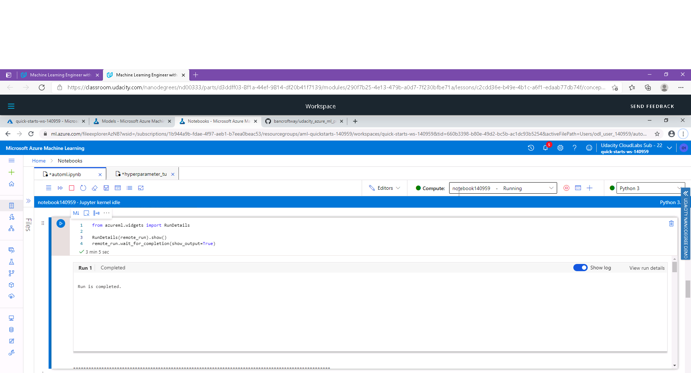
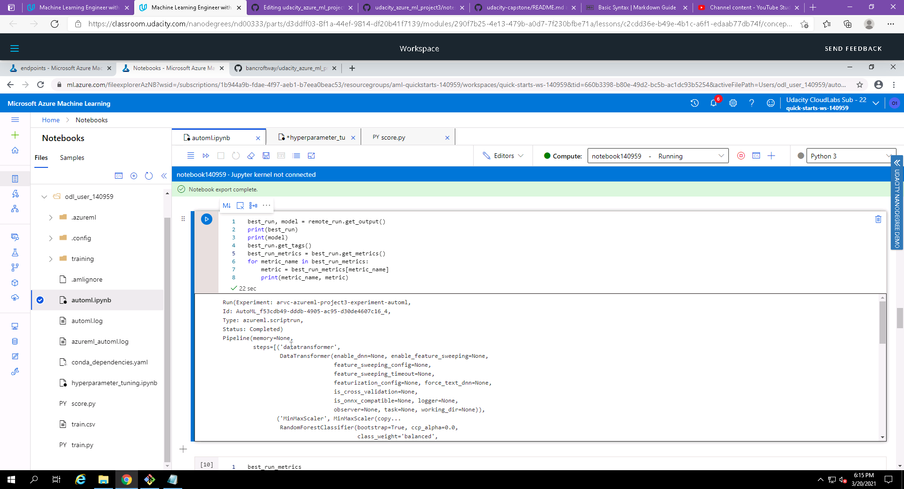
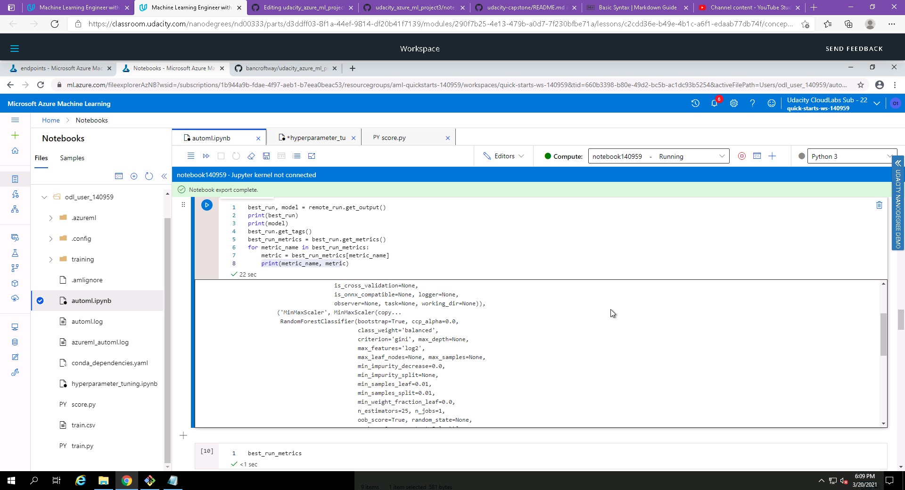
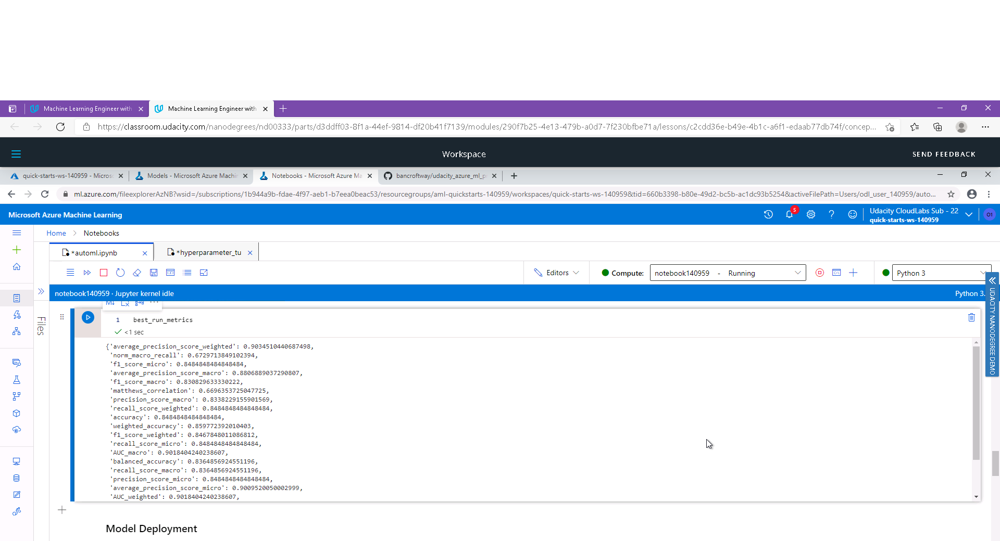
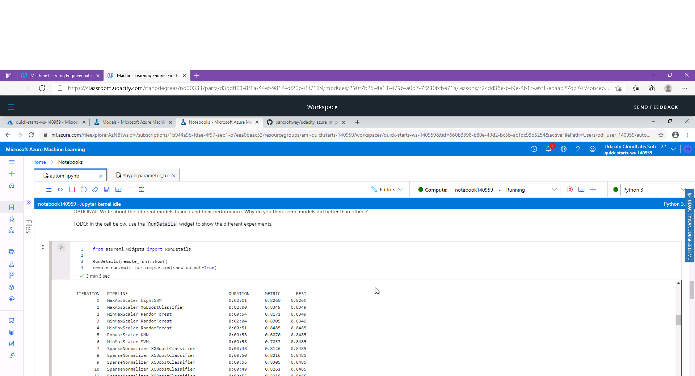

# Udacity Azure Machine Learning Engineer Nanodegree - Capstone project

A dataset called "Heart Failure Clinical Results" is used to train 2 separate models: 1. using Azure AutoML 2. using a LogisticRegression classifer whose hyper-parameters are tuned using Hyperdrive library

## Project Set Up and Installation
An Azure compute instance is required to be created to enable running the notebooks. The folowing files have to uploaded to the Azure compute instance:
1. automl.ipynb
2. hyperparameter_tuning.ipynb
3. conda_dependencies.yaml
4. train.py
5. score.py

## Dataset

### Overview
The dataset being used is called "Heart Failure Clinical Results", and is of type classification. The dataset has been obtained from UC Irvine Machine Learning Repository, and can be downloaded from this url: https://archive.ics.uci.edu/ml/machine-learning-databases/00519/heart_failure_clinical_records_dataset.csv

### Task
The dataset consists of 12 clinical features, and target class to predict is called "death event". The 12 clinical features are:

1. age: age of the patient (years)
2. anaemia: decrease of red blood cells or hemoglobin (boolean)
3. high blood pressure: if the patient has hypertension (boolean)
4. creatinine phosphokinase (CPK): level of the CPK enzyme in the blood (mcg/L)
5. diabetes: if the patient has diabetes (boolean)
6. ejection fraction: percentage of blood leaving the heart at each contraction (percentage)
7. platelets: platelets in the blood (kiloplatelets/mL)
8. sex: woman or man (binary)
9. serum creatinine: level of serum creatinine in the blood (mg/dL)
10. serum sodium: level of serum sodium in the blood (mEq/L)
11. smoking: if the patient smokes or not (boolean)
12. time: follow-up period (days)

The target column is: 
1. death event: if the patient deceased during the follow-up period (1=Yes, 0=No)

### Access
The dataset csv file is available directly through an internet link (https://archive.ics.uci.edu/ml/machine-learning-databases/00519/heart_failure_clinical_records_dataset.csv) which is being loaded into a TabularDataset in the notebook.

## Automated ML
A compute instance of type STANDARD_D3_V2 was created to run the 2 Jupyter Notebook in Azure ML Studio. 

In both the notebooks (automl.ipynb and hyperparameter_tuning.ipynb), a compute cluster was detected for existance, and if not already presence, was created, of type 'Standard_DS12_v2'.

In both the notebooks (automl.ipynb and hyperparameter_tuning.ipynb), the existence of the dataset was checked by key name, and if the dataset was not found, it was created and registered with Azure, by importing the csv file into a Tabular dataset using this code:
  Dataset.Tabular.from_delimited_files(url)

The AutoML settings used were: 
  automl_settings = {"primary_metric":"accuracy", "experiment_timeout_minutes":30, "enable_early_stopping":True, "n_cross_validations":5,"max_concurrent_iterations": 5}

The AutoML config settings for the experiment were set as:
  automl_config = AutoMLConfig(compute_target = compute_target, task = 'classification', training_data = train, label_column_name = 'DEATH_EVENT',**automl_settings)

### Results
*TODO*: What are the results you got with your automated ML model? What were the parameters of the model? How could you have improved it?
The AutoML experiment explored several models, out of which the best performing model was identified as "MinMaxScaler RandomForest" with an accuracy metric of 0.8485.

The parameters of the best model were:
  RandomForestClassifier(bootstrap=True, ccp_alpha=0.0,
  class_weight='balanced',
  criterion='gini', max_depth=None,
  max_features='log2',
  max_leaf_nodes=None, max_samples=None,
  min_impurity_decrease=0.0,
  min_impurity_split=None,
  min_samples_leaf=0.01,
  min_samples_split=0.01,
  min_weight_fraction_leaf=0.0,
  n_estimators=25, n_jobs=1,
  oob_score=True, random_state=None,
  verbose=0, warm_start=False))]
  
The model could be improved by:
1. Running the experiment for a longer time
2. Utilizing deep learning for the classification task

Screenshot of RunDetails widget:

Screenshot of best model and its run id:

Screenshot of best model and its parameters:

Screenshot of best model and its metrics:

Screenshot of models explored by AutoML and their metric values:

## Hyperparameter Tuning
*TODO*: What kind of model did you choose for this experiment and why? Give an overview of the types of parameters and their ranges used for the hyperparameter search

### Results
*TODO*: What are the results you got with your model? What were the parameters of the model? How could you have improved it?

*TODO* Remeber to provide screenshots of the `RunDetails` widget as well as a screenshot of the best model trained with it's parameters.

## Model Deployment
*TODO*: Give an overview of the deployed model and instructions on how to query the endpoint with a sample input.

## Screen Recording
Screen Recording is available here: [https://youtu.be/RzUcTHB9gas](https://youtu.be/RzUcTHB9gas)

## Standout Suggestions
*TODO (Optional):* This is where you can provide information about any standout suggestions that you have attempted.
