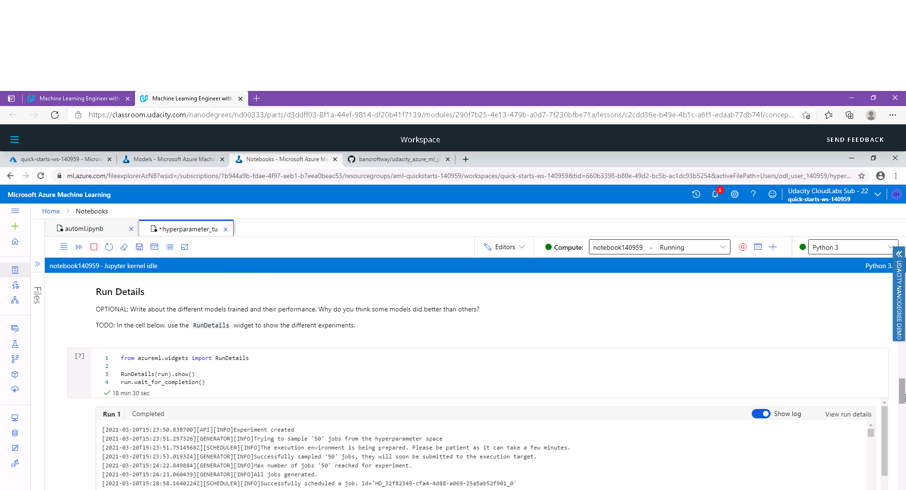
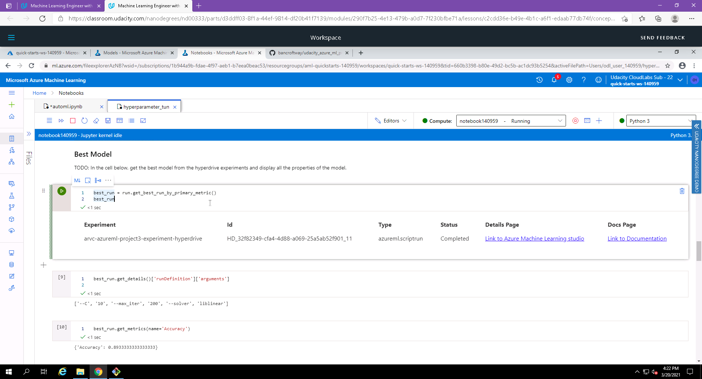
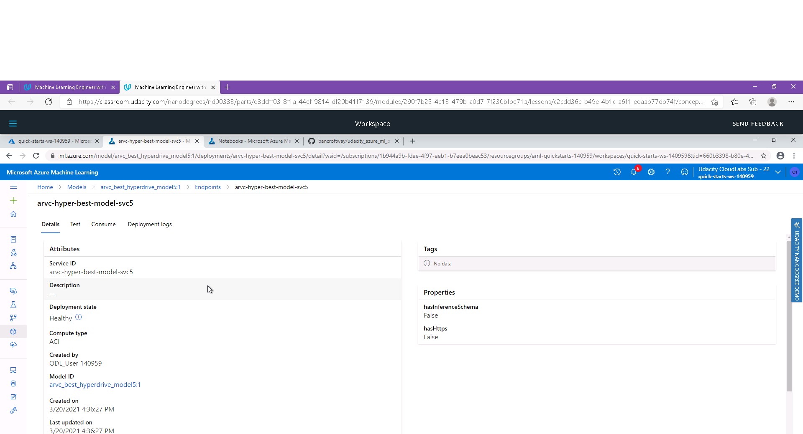
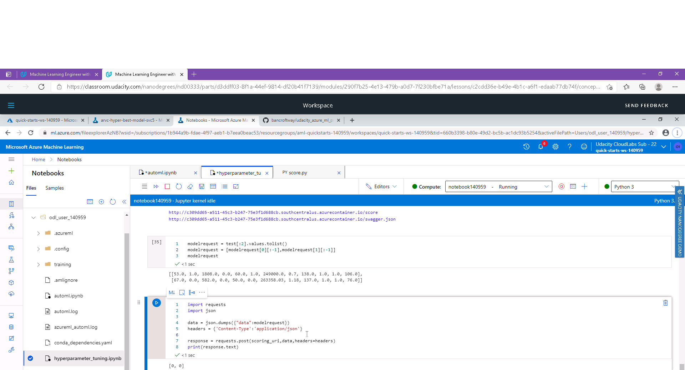

# Udacity Azure Machine Learning Engineer Nanodegree - Capstone project

A dataset called "Heart Failure Clinical Results" is used to train 2 separate models: 1. using Azure AutoML 2. using a LogisticRegression classifer whose hyper-parameters are tuned using Hyperdrive library

## Project Set Up and Installation
An Azure compute instance is required to be created to enable running the notebooks. The folowing files have to uploaded to the Azure compute instance:
1. automl.ipynb
2. hyperparameter_tuning.ipynb
3. conda_dependencies.yaml
4. train.py
5. score.py

## Dataset

### Overview
The dataset being used is called "Heart Failure Clinical Results", and is of type classification. The dataset has been obtained from UC Irvine Machine Learning Repository, and can be downloaded from this url: https://archive.ics.uci.edu/ml/machine-learning-databases/00519/heart_failure_clinical_records_dataset.csv

### Task
The dataset consists of 12 clinical features, and target class to predict is called "death event". The 12 clinical features are:

1. age: age of the patient (years)
2. anaemia: decrease of red blood cells or hemoglobin (boolean)
3. high blood pressure: if the patient has hypertension (boolean)
4. creatinine phosphokinase (CPK): level of the CPK enzyme in the blood (mcg/L)
5. diabetes: if the patient has diabetes (boolean)
6. ejection fraction: percentage of blood leaving the heart at each contraction (percentage)
7. platelets: platelets in the blood (kiloplatelets/mL)
8. sex: woman or man (binary)
9. serum creatinine: level of serum creatinine in the blood (mg/dL)
10. serum sodium: level of serum sodium in the blood (mEq/L)
11. smoking: if the patient smokes or not (boolean)
12. time: follow-up period (days)

The target column is: 
1. death event: if the patient deceased during the follow-up period (1=Yes, 0=No)

### Access
The dataset csv file is available directly through an internet link (https://archive.ics.uci.edu/ml/machine-learning-databases/00519/heart_failure_clinical_records_dataset.csv) which is being loaded into a TabularDataset in the notebook.

## Automated ML
A compute instance of type STANDARD_D3_V2 was created to run the 2 Jupyter Notebook in Azure ML Studio. 

In both the notebooks (automl.ipynb and hyperparameter_tuning.ipynb), a compute cluster was detected for existance, and if not already presence, was created, of type 'Standard_DS12_v2'.

In both the notebooks (automl.ipynb and hyperparameter_tuning.ipynb), the existence of the dataset was checked by key name, and if the dataset was not found, it was created and registered with Azure, by importing the csv file into a Tabular dataset using this code:
  Dataset.Tabular.from_delimited_files(url)

The AutoML settings used were: 
```
  automl_settings = {"primary_metric":"accuracy", "experiment_timeout_minutes":30, "enable_early_stopping":True, "n_cross_validations":5,"max_concurrent_iterations": 5}
```

The AutoML config settings for the experiment were set as:
```
  automl_config = AutoMLConfig(compute_target = compute_target, task = 'classification', training_data = train, label_column_name = 'DEATH_EVENT',**automl_settings)
```

### Results
The AutoML experiment explored several models, out of which the best performing model was identified as "MinMaxScaler RandomForest" with an accuracy metric of 0.8485.

The parameters of the best model were:
  RandomForestClassifier(bootstrap=True, ccp_alpha=0.0,
  class_weight='balanced',
  criterion='gini', max_depth=None,
  max_features='log2',
  max_leaf_nodes=None, max_samples=None,
  min_impurity_decrease=0.0,
  min_impurity_split=None,
  min_samples_leaf=0.01,
  min_samples_split=0.01,
  min_weight_fraction_leaf=0.0,
  n_estimators=25, n_jobs=1,
  oob_score=True, random_state=None,
  verbose=0, warm_start=False))]
  
The model could be improved by:
1. Running the experiment for a longer time
2. Utilizing deep learning for the classification task

#### Screenshots:
1. Screenshot of RunDetails widget:
2. Screenshot of best model and its run id:
3. Screenshot of best model and its parameters:
4. Screenshot of best model and its metrics:
5. Screenshot of models explored by AutoML and their metric values:

## Hyperparameter Tuning
LogisticRegression model was used for this experiment since it is easy to understand, does not have a lot of parameters and is well suited to classification problems.

A RandomParameterSampling strategy was used with 3 parameters for this model: 
1. solver: Algorithm to use in the optimization problem (‘newton-cg’, ‘lbfgs’, ‘liblinear’, ‘sag’, ‘saga’)
2. max_iter: Maximum number of iterations taken for the solvers to converge
3. C: Inverse of regularization strength

The code for random parameter sampling is:
```
  param_sampling = RandomParameterSampling({'C': uniform(0.01, 0.1, 1, 10, 100),
  'max_iter' : choice(50,75,100,125,150,175,200),
  'solver' : choice('liblinear','sag','lbfgs', 'saga')})
```

The primary metric used is "Accuracy", and the objective was to maximize this metric:
```
  hyperdrive_run_config = HyperDriveConfig(run_config=estimator, hyperparameter_sampling=param_sampling,policy=early_termination_policy,max_total_runs=50,
  max_duration_minutes=30,
  primary_metric_name='Accuracy',
  primary_metric_goal=PrimaryMetricGoal.MAXIMIZE)
```

### Results
The best performing model has accuracy metric of 0.8933 which exceeded the accuracy metric found by the best AutoMl model of 0.8485. The parameters of best model found by hyperdrive were:
```
  ['--C', '10', '--max_iter', '200', '--solver', 'liblinear']
```
  
The model could be improved by
1. by utilizing a more complex model such as deep learning model
2. by using more parameters (more than the current 3) to tune
3. expanding the search space, for hyperdrive to try much larger ranges of parameter values to try

#### Screenshots:
1. Screenshot of RunDetails widget:
2. Screenshot of best model, it's run id, and parameters found for the best model: 

## Model Deployment
Since the model obtained from hyper-parameter tuning has a higher accuracy of 0.8933, it was chosen to be deployed. The model was deployed using this code:
```
  service=Model.deploy(workspace=ws,
  name="arvc-hyper-best-model-svc5",
  models=[model],
  inference_config=inference_config,
  deployment_config=deployment_config)
  service.wait_for_deployment(show_output=True)
```
  
The deployed model's endpoint is exposed as a REST endpoint. We can retrieve the scoring endpoint's url like so:
```
  scoring_uri = service.scoring_uri
```
  
Once we have the scoring url, we can then submit a Json request to the scoring url by making a POST Http request, as below. In this code, the 'data' variable is a json object containing the 12 features required by our model:
```
  data = json.dumps({"data":modelrequest})
  headers = {'Content-Type':'application/json'}
  response = requests.post(scoring_uri,data,headers=headers)
  print(response.text)
```

#### Screenshots:
1. Screenshot showing the deployed model's endpoint and it's status as 'HEALTHY':
2. Screenshot showing the process to make an Http POST request to the scoring api url, by sending Json Payload:

## Screen Recording
Screen Recording is available here: [https://youtu.be/nUd91R_R6wc](https://youtu.be/nUd91R_R6wc)
